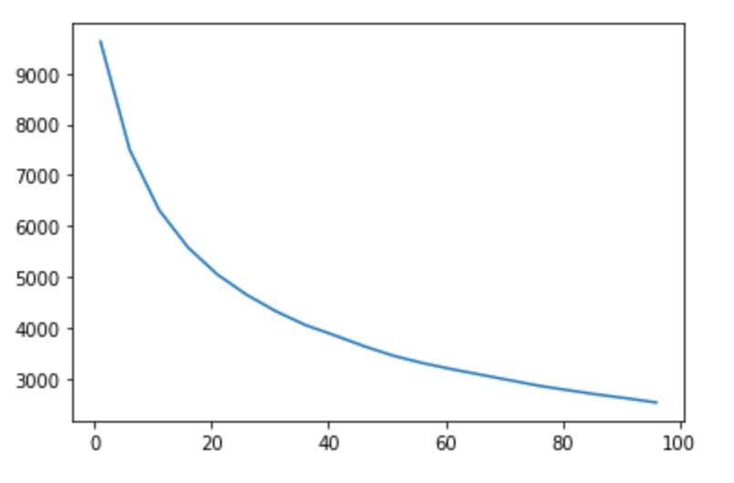

# Amazon ML Challenge
First of all we would like to thank **Amazon** and **HackerEarth** for organizing this good and interesting challenge. We as a participating team learned a lot. Also, a huge thanks to **Kaggle** and **Colab** whose free compute resources were a great help in training the models.

## The Dataset
This was a NLU based multi-class classification competition with a huge dataset. Below are 2 sample rows of the dataset.
Index | TITLE | DESCRIPTION | BULLET_POINTS | BRAND | BROWSE_NODE_ID
-|-------|-------------|---------------|-------|------
0|Pete The Cat Bedtime Blues Doll, 14.5 Inch|Pete the Cat is the coolest, most popular cat ...|[Pete the Cat Bedtime Blues plush doll,Based o...|MerryMakers| 0
1|The New Yorker NYHM014 Refrigerator Magnet, 2 ...| The New Yorker Handsome Cello Wrapped Hard Mag... | [Cat In A Tea Cup by New Yorker cover artist G... | The New Yorker | 1

Here the `BROWSE_NODE_ID` is the target label. The point to note is that the `BULLET_POINTS` are derived from the `DISCRIPTION`.

Below is a basic overview of the dataset.
Description | Value
------------|-------
Number of train samples | **`29,03,024`**
Number of test samples | **`1,10,775`**
Number of unique labels | **`9,919`**
Number of unique Brands | **`2,58,265`**

Below is the `nan` counts on train set and test set

Column | TRAIN | TEST 
-------|-------|--------
TITLE | 71 | 7
DESCRIPTION | 7,23,664 | 10,467
BULLET_POINTS | 1,66,263 | 6,786
BRAND | 56,737 | 2,430 
BROWSE_NODE_ID | 0 | -
PRODUCT_ID | - | 0

**NOTE**: The product id is the `primary key` for the test set.

## Our Approach:
With so many target labels we plotted the labels according to their value counts   
The `X-axis` is the number of occurances and the `Y-axis` is the number of undelying classes. This shows that about `1700` classes were occuring more than `100` times and the rest were occuring less than `100` times.

After seeing this curve the most reasonable question was `What labels will test set contain?`. As some classes were occuring very few times in a huge dataset there was more than surety that they will not occur in the test set. With that idea we though of dividing the dataset on different buckets on the basis of number of occurances of each class.
We made several buckets at about `>=80`, `>=110`, `>=150`, `>=200`.The best result was given by the bucket with occurances `>=110`.

Now the biggest challenge was to form a proper validation set for local testing. For this we initially made a stratified train and valid set with a ratio of `70-30`. Then we moved for making a baseline model. Here another challenge was to make a fast experimental setup as the dataset was huge.

In this case a `uniform random predictor` would had a very very low accuracy cause of large number of classes and imbalanced occuraces so we moved straight towards `BERT base uncased` with default parameters and a `max_length` of `250` for text. Here we combined `TITLE` and `BULLET_POINTS` to form the text and imputed `nan` as `string` at all `nan` values.  
Reasons to choose `TITLE` and `BULLET_POINTS`:
* Fewer Nan values in both `Train` and `Test` set.
* Low `max_length` for text could still yield good results.
* `BULLET_POINTS` is derived from description and hence contains more precise signals.

**Challenges in making the baseline** -> While creating the baseline the size of the dataset was a huge issue. While tokenizing the dataset we had to take into account the memory overflow we tokenize all the dataset. So, we moved on to tokenizing the dataset in **Chunks** and then training the model on those chunks. This lead to a further implication of validating the training. We wanted to keep a track of validation values in each chunk but the whole validation set was itself too large. For this we used `uniform random sampler` to sample `25,000` indexes from valid set for which we will validate on each chunk. This gave us the required diversity and speed. This gave us a good baseline at the end.

**Challenges in improving the accuracy** -> Without having a good and complete representation of test set in the validation set we were unsure of which values should be changed and in what direction so we training another model with increased `max_length` and trained a `RoBERTa base`. After training these models we observed that due to many differnt values of `labels` we needed a better representation of the `text` and following things could help:
 * Increasing the `max_length`
 * Using a more complex model with large output embeddings
 * Using different architectures might help

The experiments on these ideas saw a huge setback due to increased computation cost. Many times we faced `Out Of Memory` issue in the middle of training (In PyTorch-Lightning) which wasted important computation time.

We also tried to preprocess the dataset but it as expected it didn't help with Transformer based models as it only removed the context.

Another thing we tried was to resample the bucketed dataset to have uniform values of each classes but the results were moderate.

In the end we got our best results on a finetuned `BERT base uncased` with using `TITLE` and `BULLET_POINTS` as a sentence pair insted of simple concatination at bucket of `>=110` occurances.

**Problem with large models** -> The large models were taking a lot of time to train and needed a larger `max_length` which further raised the Memory issue. Also, the finetuing of these models needed a larger batch size for `Stable Gradients` but the largest batch size we could efford was `64`. We tried to use `Gradient Accumulation` on `PyTorch-lightning trainer` but it gave `OOM` in the middle of training which only wasted our compute time.

## Future Enhancements
After re-analysis of our approach We beleive these could have yielded better results
 * A more robust validation strategy without much increase in compute cost would have helped the most
 * Training on concat of `TITLE` and `BULLET_POINTS` and then using `DESCRIPTION` along with the concat as sentence pair for training. (This will increase the compute cost greatly)
 * A better understaning of implimentation of `mixed-precision` and `Gradient Accumulation` in `TensorFlow` which will allow to train larger models.
 * Creating a Multi-Channel model to experiment with `BRAND`
 * Using the output of a couple of last encoder layers of the transformer model.

## My Team:
* ### [Utkarsh Gupta](https://www.linkedin.com/in/utkarsh-gupta007/)
* ### [Pranav Anand](https://www.linkedin.com/in/pranavanand24/)
* ### [Aman Thakur](https://www.linkedin.com/in/athakur1703/)
* ### [Abhishek Prajapat (Me)](https://www.linkedin.com/in/AbhishekPrajapat/)

**Team Name** -> For the most creative we have ever been we named our team as **`Dekho-Magar-Pyar-Se`** which translates to **`See-But-With-Love`**.

## Trained models
If needed the some of the trained models can be downloaded from [here](https://drive.google.com/drive/folders/1dgNHLTWvd7l96dgyecqo9leVG4POTzBl?usp=sharing).  
**Note**: Not every trained model is listed here.

## Hardware used:
For our experiments we used the free **Kaggle** and **Colab** TPUs. 
The TPU provided by Kaggle has 128GB Memory and 16GB RAM while the one provided by Colab has 64GB Memory and 12GB RAM per team member.
